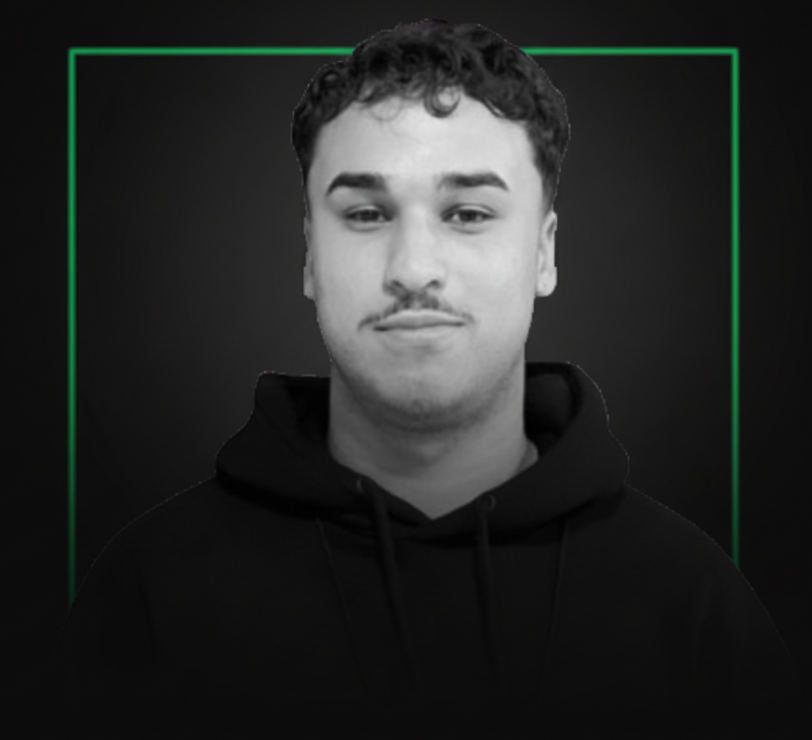
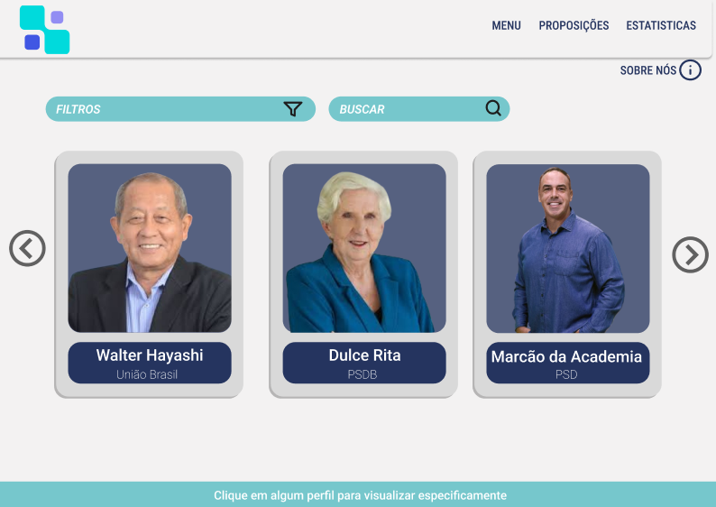
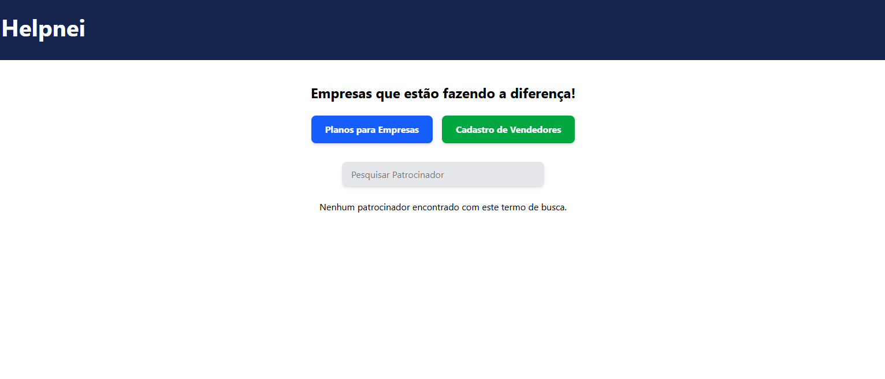
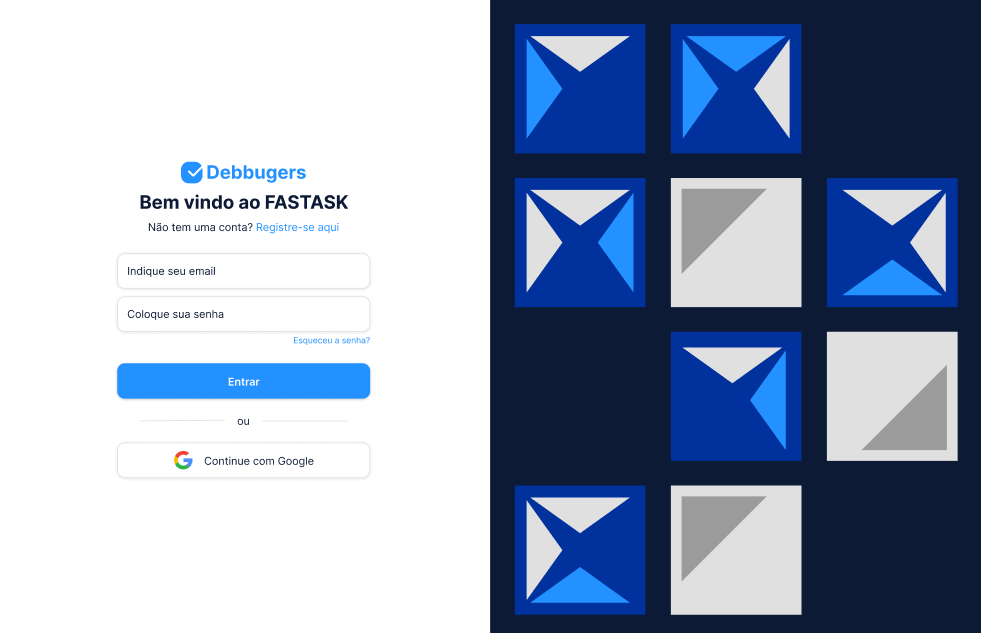

# Portfólio de Trabalho de Graduação - Lucas Guerra

## Sumário

1. [Apresentação do Aluno](#1-apresentação-do-aluno)
2. [Projetos API](#2-projetos-api)
    2.1 [1º Semestre (2024-2) - Byte (Fatec)](#21-1º-semestre-2023-2---byte-fatec)
    2.2 [2º Semestre (2025-1) - Debuggers - Helpnei](#22-2º-semestre-2024-1---debuggers---helpnei)
    2.3 [3º Semestre (2025-2) - FASTTASK (GSW)](#23-3º-semestre-2024-2---fasttask---gsw)
3. [Outros Projetos](#3-outros-projetos)

---

## 1. Apresentação do Aluno

  

 

* **Nome:** Lucas Fernando Guerra
* **Idade:** 21 anos

### Curso
Tecnólogo em Desenvolvimento de Software Multiplataforma - Fatec São José dos Campos

### Histórico Acadêmico
* **2024 - Atual:** FATEC - São José dos Campos (Tecnólogo em Desenvolvimento de Software Multiplataforma)
* **2022 - 2024:** UNIP - Universidade Paulista (Tecnólogo em Análise e Desenvolvimento de Sistemas)
* **2024:** Cursos complementares na EBAC (JavaScript), ORIGAMID (Front-end) e Escola de Inovadores Fatec.

### Motivação
Sempre fui apaixonado por tecnologia. Essa curiosidade me levou à Fatec São José dos Campos, onde ingressei no curso de Desenvolvimento de Software Multiplataforma buscando uma base sólida e prática para minha carreira.

### Histórico Profissional
Atualmente, possuo experiência prática através de projetos acadêmicos robustos e trabalhos como freelancer, focando em soluções completas (Back-end e Front-end). Estou em busca de novas oportunidades formais para aplicar meus conhecimentos em React, Node.js e Java.

### Contatos
* **LinkedIn:** [linkedin.com/in/lucas-guerra000](https://linkedin.com/in/lucas-guerra000)
* **GitHub:** [github.com/lucasguerra12](https://github.com/lucasguerra12)
* **E-mail:** lucasguerrawr2004@gmail.com

### Principais Conhecimentos
* **Front-end:** React, TypeScript, JavaScript, HTML5, CSS3, Vite, Figma.
* **Back-end:** Java (Spring), Node.js, Python (Flask, Django), MySQL, MongoDB, Firebase.

---

## 2. Projetos API

### 2.1 1º Semestre (2024-2) - Byte (Fatec)

* **Parceiro Acadêmico:** Fatec (Prof. Jean e Masanori)
* **Link do Repositório:** [github.com/Byte-Team-Fatec/Byte_Team-API-1-](https://github.com/Byte-Team-Fatec/Byte_Team-API-1-)

#### Problema
O problema central identificado foi a dificuldade de acesso e compreensão dos dados legislativos disponibilizados pela Câmara Municipal de São José dos Campos. As informações sobre a atuação dos vereadores estavam dispersas, dificultando o acompanhamento pela população.

#### Solução
A equipe desenvolveu um website informativo e acessível que centraliza e organiza os dados referentes aos vereadores. A aplicação permite que qualquer eleitor visualize rapidamente presenças, faltas, proposições apresentadas e o perfil individual.

#### Contribuições Pessoais
Atuei como **Product Owner (PO)**. Fui responsável por organizar o backlog do Jira e validar se as entregas correspondiam aos requisitos, aprendendo a importância de metodologias ágeis.

#### Hard Skills
* **HTML5 / CSS3 / JavaScript:** Faço com autonomia.
* **Python (Flask) / MySQL:** Faço com ajuda.
* **Figma / Jira / Git:** Faço com autonomia.

#### Soft Skills
* **Liderança:** Guiei o time nas prioridades e foco nos objetivos.
* **Comunicação:** Apresentação dos requisitos e alinhamento com os clientes (professores).
* **Organização:** Mantive o backlog do Jira atualizado.

Ver Imagem do Projeto

---

### 2.2 2º Semestre (2025-1) - Debuggers - Helpnei

* **Parceiro Acadêmico:** Helpnei
* **Link do Repositório:** [github.com/matheuskarnas/API-2](https://github.com/matheuskarnas/API-2)

#### Problema
O principal desafio foi a falta de uma plataforma digital moderna e centralizada que conseguisse divulgar e valorizar as empresas patrocinadoras do programa Helpnei.

#### Solução
Desenvolvimento de uma plataforma web interativa, intuitiva e responsiva. O sistema permite o cadastro de empresas e utiliza mapas para facilitar a localização dos patrocinadores.

#### Contribuições Pessoais
Atuei no **Front-end**, onde tive meu primeiro contato com **React** e **TypeScript**. Fui responsável pela criação de componentes tipados e pela integração visual da plataforma.

#### Hard Skills
* **React / TypeScript / Vite:** Faço com autonomia.
* **Vercel:** Faço com autonomia.
* **Supabase:** Faço com ajuda.

#### Soft Skills
* **Comunicação:** Alinhamento constante com o time de back-end.
* **Resolução de Problemas:** Enfrentei desafios técnicos ao integrar APIs de mapa.

Ver Imagem do Projeto

---

### 2.3 3º Semestre (2025-2) - FASTTASK (GSW)

* **Parceiro Acadêmico:** GSW
* **Link do Repositório:** [github.com/debuggersFatec/API-3](https://github.com/debuggersFatec/API-3)

#### Problema
A dificuldade recorrente de equipes e profissionais individuais em organizar tarefas de forma colaborativa e visual, impactando a produtividade.

#### Solução
O **GSW Task Manager**, uma aplicação web colaborativa que permite criar, gerenciar e acompanhar tarefas em tempo real.

#### Contribuições Pessoais
Atuei como desenvolvedor **Back-end (Java/Spring)**. Foi um período de grande aprendizado sobre linguagens robustas e tipadas no servidor.Devo  destacar que durante esse projeto,enfrentamos diversas dificuldades que poderiam ser evitada caso tivessemos levados com mais profissionalismo,como a questao de gerir a equipe scrum e todos seus processos,deixar de lado amizade e coisas do tipo,cobrar com mais rigorosidade e com menos intervalos para erros

#### Hard Skills
* **Java (Spring) / MongoDB:** Faço com ajuda.
* **React / TypeScript:** Faço com autonomia.
* **Git / Jira / Figma:** Faço com autonomia.

#### Soft Skills
* **Proatividade:** Sugeri melhorias no design da sidebar.
* **Colaboração:** Trabalho conjunto com front e back-end.

Ver Imagem do Projeto

---

## 3. Outros Projetos

| Projeto | Descrição | Tecnologias | Link |
| --- | --- | --- | --- |
| **World Beauty** | Sistema de gestão para salões (Fatec). | React, TyseScript, Bootstrap | [GitHub](https://github.com/lucasguerra12/WB) |
| **Aerocode** | Dashboard de gestão para aviação. | TypeScript, React | [GitHub](https://github.com/lucasguerra12/AV3) |
| **HAKA COMPANY** | Loja de roupas em WordPress (Em andamento). | React, TypeScript, Node.js | - |
| **Synex** | Landing page corporativa (Em andamento). | JavaScript, HTML, CSS | - |
| **Dunkel Company** | E-commerce Dark Mode (Em andamento). | React, Node.js | - |
| **Pratik** | App de conexão de serviços (Em andamento). | Vue.js, Node.js | - |
